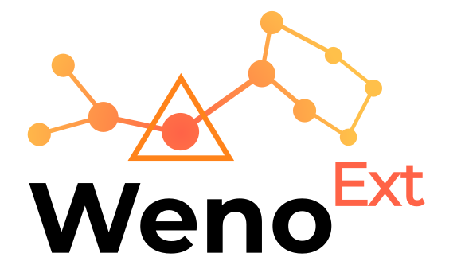

# WENO framework

Weighted essentially non-oscillatory library for the framework of OpenFOAM.
Detailed information about the theoretical background and the implementation can 
be found in:

 * [J. W. Gärtner, A. Kronenburg, T. Martin, Efficient WENO library for OpenFOAM, SoftwareX, 2020](./documentation/Gaertner2020.pdf)
 * [Development of a Finite Volume Solver for Two-phase Incompressible Flows using a Level Set Method](./documentation/Martin_Development_of_a_Finite_Volume_Solver_for_Two-phase_Incompressible_Flows_using_a_Level_Set_Method.pdf)
 * [Solving the Level Set Equation using High-order Non-oscillatory Reconstruction](./documentation/Martin_Solving_the_Level_Set_Equation_using_High-order_Non-oscillatory_Reconstruction.pdf)

A quick overview of the WENO scheme is provided in this presentation:

 * [Presentation: WENOExt](./documentation/WENO-Presentation.pdf)

**Versions:**

Different versions of the code are structured through tags:

 * [2.0] Improved speed by using Blaze matrix operations
 * [1.0] Version for OpenFOAM 5.x, 6 and 7.
             Uses improved parallising and C++11 features 
 * [0.1] Version for OpenFOAM 2.3.x to OpenFOAM 5.x 

### Supported OpenFOAM Versions:

 * OpenFOAM (ORG) v5.x - 7
 * OpenFOAM (ESI) v1912

## Authors

 * Tobias Martin <tobimartin2@googlemail.com>
 * Jan Wilhelm Gärtner <jan.gaertner@outlook.de>

When using this work please cite:
> J. W. Gärtner, A. Kronenburg, and T. Martin, “SoftwareX Efficient WENO library for OpenFOAM,” SoftwareX, vol. 12, p. 100611, 2020, doi: 10.1016/j.softx.2020.100611.

## Installation

1. Clone the directory with
    `git clone https://github.com/WENO-OF/WENOEXT.git`

2. Execute `Allwmake` to build the library


### Note to GNU compiler:

GNU compiler version must be higher than 7. For g++ < v7 an error is reported for 
the specialisation template syntax. 
The syntax in the code is according to C++11 standard which is available for g++ v7 and higher. 
 

## Usage

To use the WENO scheme you have to add the library to your controlDict by editing `system/controlDict`

    libs("libWENOEXT.so")

Within your `system/fvSchemes` file,

    divSchemes
    {
    	div(phi,U) 	Gauss WENOUpwindFit 2 1;
    }

Here the first index '2' represents the order of the WENO scheme and the second index can be either
'1' for bounded or '0' for unbounded.

Further options can be set in the WENODict located in the 'system/' folder:

```C++
/*--------------------------------*- C++ -*----------------------------------*\
| =========                 |                                                 |
| \\      /  F ield         | OpenFOAM: The Open Source CFD Toolbox           |
|  \\    /   O peration     | Version:  2.3.0                                 |
|   \\  /    A nd           | Web:      www.OpenFOAM.org                      |
|    \\/     M anipulation  |                                                 |
\*---------------------------------------------------------------------------*/
FoamFile
{
    version     2.0;
    format      ascii;
    class       dictionary;
    location    "system";
    object      WENODict;
}
// * * * * * * * * * * * * * * * * * * * * * * * * * * * * * * * * * * * * * //
 
// This dict contains expert parameters, which modify the standard WENO scheme.

    //- Stencil extension ratio:
    //  - < 2.5 :   decreased computational effort. May also decrease stability
    //              and accuracy
    //  - > 2.5 :   higher stability. May influence the accuracy of the SVD
    extendRatio     2.5;

    //- WENO stencil weighting parameters:
    p               4.0;
    dm              1000.0;

    //- Calculate best conditioned matrix
    //  This can save memory especially for high order WENO scheme
    //  Increases the calculation time! Default is off
    bestConditioned true;
    
    writeData       true; // Write out the collected stencil list and matrix data
                          // default is 'true' 

    maxCondition    1E-05;// Inverse of the maximum condition that the pseudo 
                          // inverse can have. Only change if you know what you
                          // are doing!

// ************************************************************************* /
```

## Tutorials

The code contains two tutorials from the standard cavity test. 
To run the tutorials execute `./Allrun` in the tutorial/ directory.

## Tests

Testing is performed with the CATCH2 framework. You can compile and execute the tests
by executing `./runTest` in the test directory. Further instructions are found in [here](tests/TestInstructions.md) 


## License 

This OpenFOAM library is under the GNU General Public License. This library contains the [Blaze](https://bitbucket.org/blaze-lib/blaze/src/master/) library licensed under the BSD license. 
Redistribution and use of the Blaze source code with or without modification, are permitted provided that the following conditions are met:

  * Redistributions of source code must retain the above copyright notice, this list of conditions and the following disclaimer.
  * Redistributions in binary form must reproduce the above copyright notice, this list of conditions and the following disclaimer in the documentation and/or other materials provided with the distribution.
  * Neither the names of the **Blaze** development group nor the names of its contributors may be used to endorse or promote products derived from this software without specific prior written permission.


